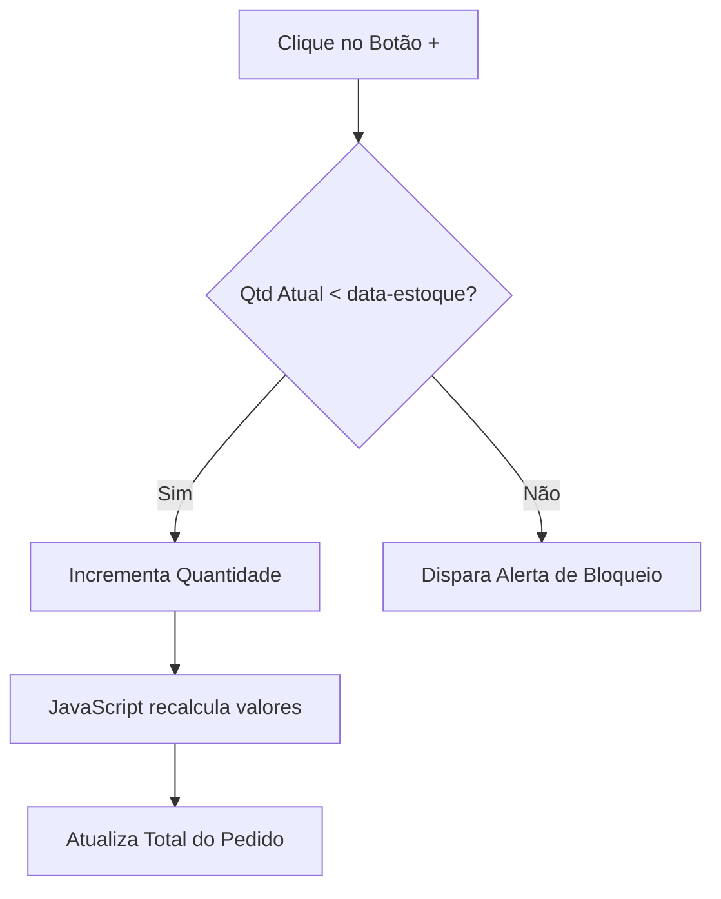

# 🍢 Espetinho do Edir — Sistema de Gestão Comercial e PDV

<p align="center">
  <strong>Jhader Augusto</strong> — Líder Técnico do Projeto
  <br>
  Arquitetura Back-end • Flask • Engenharia de Regras de Negócio • Processos Front-end
</p>

<p align="center">
  Desenvolvido em equipe com Pedro Neves e Camila Emanuelle
</p>

---

> 🚀 **Projeto Integrador / Trabalho Final de Curso (Em Desenvolvimento)**
>
> Embora concebido como um projeto acadêmico para consolidação de conhecimentos, este sistema foi planejado, estruturado e arquitetado para atender a uma operação comercial real. Toda a especificação de requisitos e regras de negócio foi baseada nas necessidades práticas observadas diretamente em um comércio ativo, focado estritamente no gerenciamento interno da empresa.

O sistema foi pensado sob medida para a operação de uma espetaria, abrangendo desde a frente de caixa reativa (PDV) até o fluxo operacional da cozinha e auditoria gerencial.

---

# 📌 Objetivo do Projeto

O objetivo principal do sistema é centralizar e otimizar o fluxo operacional interno de uma espetaria, reduzindo falhas humanas, melhorando o controle de estoque, automatizando processos de venda e facilitando a comunicação entre caixa, cozinha e gestão administrativa.

O projeto também foi utilizado como laboratório prático para aplicação de conceitos modernos de:

- Arquitetura Back-end
- Segurança de Aplicações (AppSec)
- Organização modular de sistemas
- Integração Front-end e Back-end
- Controle de sessões e autenticação
- Boas práticas de engenharia de software

---

# 🛠️ Tecnologias e Ferramentas


---

# 👥 Equipe & Estrutura de Desenvolvimento

O projeto está sendo desenvolvido de forma colaborativa, com divisão estratégica das responsabilidades conforme a especialidade técnica de cada integrante.

| Integrante | Responsabilidades |
|---|---|
| **Jhader Augusto** | Liderança técnica, arquitetura do sistema, desenvolvimento Back-end com Flask, engenharia de regras de negócio, segurança da aplicação e integração dos processos Front-end |
| **Pedro Neves** | Estruturação do Back-end, apoio na arquitetura do sistema e desenvolvimento da lógica da aplicação |
| **Camila Emanuelle** | Interface visual, estilização da aplicação, experiência do usuário e interatividade Front-end com CSS e JavaScript |

---

# 💼 Validação no Mundo Real & Diferencial Prático

Diferente de projetos acadêmicos puramente teóricos, o desenvolvimento do sistema foi guiado por um mapeamento de processos reais observados em uma operação comercial ativa.

## Principais diferenciais implementados:

- Controle de estoque reativo em tempo real
- Bloqueio automático de vendas acima do estoque disponível
- Ocultação dinâmica de produtos esgotados
- Integração operacional entre PDV e cozinha
- Estrutura administrativa separada do operador de caixa
- Fluxo de cancelamento com estorno automático
- Controle de acesso por nível de privilégio

---

# 🛡️ Boas Práticas e Engenharia Aplicada

Desde o início do projeto, buscamos aplicar conceitos próximos de ambientes corporativos reais:

- Estruturação modular de pastas (`templates`, `static`, `routes`, etc.)
- Uso de ambientes virtuais (`venv`) para isolamento de dependências
- Controle de dependências via `requirements.txt`
- Organização da aplicação utilizando Flask Blueprints
- Implementação inicial de proteção contra força bruta utilizando `Flask-Limiter`
- Separação entre camada visual e lógica de negócio
- Planejamento de autenticação segura com `Bcrypt`
- Planejamento de armazenamento seguro de segredos via `.env`
- Planejamento de persistência utilizando banco de dados relacional

---

# 🔐 Segurança da Aplicação

Mesmo em fase de prototipagem, o projeto já incorpora preocupações relacionadas à segurança de aplicações web.

## Medidas já implementadas:

- Controle de sessão utilizando `flask.session`
- Restrições de acesso por privilégio
- Proteção básica contra força bruta com `Flask-Limiter`
- Validação de acesso às rotas administrativas
- Organização modular visando manutenção segura

## Roadmap de segurança:

- Hash seguro de senhas utilizando `Bcrypt`
- Migração de credenciais para banco de dados
- Implementação de variáveis de ambiente (`.env`)
- Hardening da autenticação
- Refatoração completa do gerenciamento de usuários

---

# 📱 Demonstração da Interface (Preview)

https://github.com/user-attachments/assets/ff3a1f2a-03f1-4ea8-906f-8902d1cf588f

<p align="center">
  
</p>

---

# 🔐 Credenciais de Teste

Para navegação entre os módulos do sistema:

| Perfil | Usuário | Senha |
|---|---|---|
| **Administrador / Gerente** | `admin@brasas.com` | `admin123` |
| **Operador de Caixa / PDV** | `teste@brasas.com` | `123456` |

---

# 🧠 Desafios Técnicos & Aprendizados

## 1. Modularização da Aplicação

### Desafio:
Evitar acoplamento excessivo entre autenticação, vendas e administração.

### Solução:
Implementação de Flask Blueprints para separação de responsabilidades e organização escalável da aplicação.

---

## 2. Sincronização de Estoque em Tempo Real

### Desafio:
Impedir vendas acima do estoque disponível sem gerar múltiplas requisições HTTP.

### Solução:
Uso de atributos personalizados no DOM (`data-estoque`, `data-preco`) combinados com JavaScript Vanilla para validações reativas no front-end.

---

## 3. Controle de Acesso e Sessões

### Desafio:
Evitar acesso indevido ao painel administrativo via alteração manual de URL.

### Solução:
Validação ativa de sessões e níveis de privilégio utilizando `flask.session`.

---

# 🔄 Fluxo do Carrinho de Vendas



---

# 📂 Estrutura Base do Projeto

```bash
📦 espetinho-do-edir
 ┣ 📂 static
 ┃ ┣ 📂 css
 ┃ ┣ 📂 js
 ┃ ┗ 📂 img
 ┣ 📂 templates
 ┣ 📂 routes
 ┣ 📂 auth
 ┣ 📂 admin
 ┣ 📂 pdv
 ┣ 📜 app.py
 ┣ 📜 requirements.txt
 ┗ 📜 README.md
```

---

# 🚧 Roadmap do Projeto

## 🔙 Back-end
- [ ] Integração com banco de dados SQL
- [ ] Sistema real de autenticação
- [ ] Hash de senha com Bcrypt
- [ ] API REST interna
- [ ] Logs administrativos

## 🎨 Front-end
- [ ] Melhorias de responsividade
- [ ] Painel administrativo avançado
- [ ] Feedback visual em tempo real
- [ ] Dashboard gerencial

## 🛡️ Segurança
- [ ] Variáveis de ambiente
- [ ] Hardening de autenticação
- [ ] Proteção CSRF
- [ ] Controle de sessões avançado

---

# 📚 Aprendizados Obtidos

Durante o desenvolvimento do projeto, foram aprofundados conhecimentos em:

- Arquitetura de aplicações Flask
- Engenharia de software
- Segurança de aplicações web
- Estruturação modular
- Integração Front-end e Back-end
- Manipulação dinâmica do DOM
- Controle de sessão
- Organização colaborativa de projetos

---

# 📌 Status do Projeto

🚧 Projeto em desenvolvimento contínuo.

Atualmente em fase de expansão da arquitetura, melhoria de segurança e implementação de persistência de dados.

---

# 📄 Licença

Projeto desenvolvido para fins educacionais e de portfólio.
