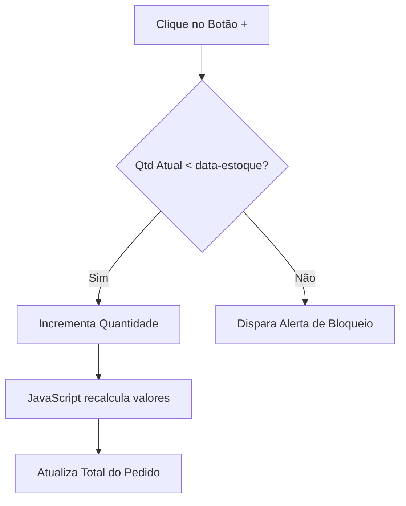

# 🍢 Espetinho do Edir — Sistema de Gestão Comercial e PDV

<p align="center">
  <strong>Jhader Augusto</strong> — Líder Técnico do Projeto
  <br>
  Arquitetura Back-end • Flask • Engenharia de Regras de Negócio • Processos Front-end
</p>

<p align="center">
  Desenvolvido em equipe com Pedro Neves, Camila Emanuelle e Arthur Luís
</p>

---

> 🚀 **Projeto Integrador / Trabalho Final de Curso (Em Desenvolvimento)**
>
> Embora concebido como um projeto acadêmico para consolidação de conhecimentos, este sistema foi **planejado, estruturado e arquitetado para atender a uma operação comercial real**. Toda a especificação de requisitos e regras de negócio foi baseada nas necessidades práticas observadas diretamente em um comércio ativo, focado estritamente no gerenciamento interno da empresa.

O sistema foi pensado sob medida para a operação de uma espetaria, abrangendo desde a frente de caixa reativa (PDV) até o fluxo operacional da cozinha e auditoria gerencial.

---

# 📌 Objetivo do Projeto

O objetivo principal do sistema é centralizar e otimizar o fluxo operacional interno de uma espetaria, reduzindo falhas humanas, melhorando o controle de estoque, automatizando processos de venda e facilitando a comunicação entre caixa, cozinha e gestão administrativa.

O projeto também é utilizado como laboratório prático para aplicação de conceitos modernos de:

- Arquitetura Back-end
- Segurança de Aplicações (AppSec)
- Organização modular de sistemas
- Integração Front-end e Back-end
- Controle de sessões e autenticação
- Boas práticas de engenharia de software

---

# 🛠️ Tecnologias e Ferramentas


---

# 👥 Equipe & Estrutura de Desenvolvimento

O projeto está sendo desenvolvido de forma colaborativa, com divisão estratégica das responsabilidades conforme a especialidade técnica de cada integrante.

| Integrante | Responsabilidades |
|---|---|
| **Jhader Augusto** | Liderança técnica, arquitetura do sistema, desenvolvimento Back-end com Flask, engenharia de regras de negócio, segurança da aplicação e integração dos processos Front-end |
| **Pedro Neves** | Estruturação do Back-end, apoio na arquitetura do sistema e desenvolvimento da lógica da aplicação |
| **Camila Emanuelle** | Interface visual, estilização da aplicação, experiência do usuário e interatividade Front-end com CSS e JavaScript |
| **Arthur Luís** | Concepção técnica inicial, mapeamento e desenvolvimento da etapa de prototipação estrutural do site. |

---

# 💼 Validação no Mundo Real & Diferencial Prático

Diferente de projetos acadêmicos puramente teóricos, o desenvolvimento do sistema foi guiado por um mapeamento de processos reais observados em uma operação comercial ativa.

## Principais diferenciais implementados:

- Controle de estoque reativo em tempo real
- Bloqueio automático de vendas acima do estoque disponível
- Ocultação dinâmica de produtos esgotados
- Integração operacional entre PDV e cozinha
- Estrutura administrativa isolada do operador de caixa
- Fluxo de cancelamento com estorno automático de insumos
- Controle de acesso por nível de privilégio (RBAC)

---

# 🛡️ Boas Práticas e Engenharia Aplicada

Buscamos aplicar conceitos arquiteturais e de infraestrutura próximos aos encontrados em ambientes corporativos reais:

- Estruturação modular de pacotes (`templates`, `static`, `routes`)
- Uso de ambientes virtuais (`venv`) para isolamento e reprodutibilidade do ecossistema
- Controle de dependências e pacotes via `requirements.txt`
- Organização desacoplada de rotas utilizando Flask Blueprints
- Implementação de proteção contra ataques automatizados de força bruta com `Flask-Limiter`
- Separação entre camada visual (View) e lógica de negócio (Controller)
- Planejamento de criptografia e hashing seguro de credenciais com `Bcrypt`
- Isolamento de chaves e credenciais sensíveis através de variáveis de ambiente (`.env`)

---

# 🔐 Segurança da Aplicação

Mesmo em fase de prototipagem, o projeto incorpora preocupações rigorosas relacionadas à segurança da informação em aplicações web.

## Medidas já implementadas:

- Controle e validação de estado de sessão via `flask.session`
- Bloqueio de rotas administrativas para usuários sem privilégios gerenciais (RBAC)
- Rate-limiting acoplado ao endereço IP do cliente (`get_remote_address`) para mitigação de ataques de força bruta
- Configuração refinada do `.gitignore` para evitar vazamento de binários e arquivos locais

## Roadmap de segurança:

- Implementação de hash criptográfico de senhas via `Bcrypt`
- Migração da persistência em memória para banco de dados relacional
- Implementação de proteção contra ataques CSRF
- Hardening da autenticação
- Expansão do controle de sessões

---

# 📱 Demonstração da Interface (Preview)

https://github.com/user-attachments/assets/ff3a1f2a-03f1-4ea8-906f-8902d1cf588f

<p align="center">
  
</p>

---

# 🔐 Credenciais de Teste

Para navegação entre os módulos do sistema durante a homologação local:

| Perfil | Usuário | Senha |
|---|---|---|
| **Administrador / Gerente** | `admin@brasas.com` | `senha123` |
| **Operador de Caixa / PDV** | `teste@brasas.com` | `123456` |

---

# 🧠 Desafios Técnicos & Aprendizados

## 1. Modularização da Aplicação

### Desafio:
Evitar acoplamento excessivo e arquivos monolíticos contendo toda a lógica de autenticação, vendas e administração.

### Solução:
Implementação de Flask Blueprints, distribuindo o fluxo em controladores especializados e independentes dentro do diretório `routes/`.

---

## 2. Sincronização de Estoque em Tempo Real

### Desafio:
Impedir vendas acima do estoque físico disponível sem sobrecarregar o servidor com múltiplas requisições HTTP síncronas.

### Solução:
Injeção de metadados estruturados no DOM (`data-estoque`, `data-preco`) consumidos dinamicamente por funções em JavaScript Vanilla (ES6), responsáveis pelas validações reativas diretamente na interface.

---

## 3. Controle de Acesso e Sessões

### Desafio:
Garantir que usuários comuns não consigam acessar rotas administrativas manipulando URLs manualmente.

### Solução:
Implementação de validação ativa de sessões e controle de privilégios utilizando `flask.session`.

---

# 🔄 Fluxo do Carrinho de Vendas



---

# 📂 Estrutura Base do Projeto

```plaintext
espetinho-do-edir/
│
├── routes/                  # Camada de Controladores (Blueprints Modularizados)
│   ├── __init__.py
│   ├── admin.py             # Painel administrativo e gerenciamento interno
│   ├── auth.py              # Login, autenticação e sessões
│   └── vendas.py            # Regras da frente de caixa (PDV)
│
├── static/                  # Arquivos estáticos globais
│   ├── css/
│   ├── img/
│   ├── js/
│   └── mp4/
│
├── templates/               # Templates Jinja2
│   ├── admin_page.html
│   ├── login_page.html
│   └── projeto.html
│
├── app.py                   # Inicializador principal da aplicação
├── banco.py                 # Persistência de dados em memória
├── requirements.txt         # Dependências do projeto
└── README.md
```

---

# 🚧 Roadmap do Projeto

## 🔙 Back-end

- [ ] Integração com banco de dados relacional SQL (SQLAlchemy / PostgreSQL)
- [ ] Sistema de persistência permanente de pedidos
- [ ] Implementação de API REST interna
- [ ] Geração de logs administrativos e auditoria gerencial

## 🎨 Front-end

- [ ] Ajustes e testes de responsividade
- [ ] Painel avançado de cozinha
- [ ] Feedback visual síncrono de pedidos
- [ ] Dashboard gerencial com métricas financeiras

## 🛡️ Segurança

- [ ] Variáveis de ambiente (`.env`)
- [ ] Hardening da autenticação
- [ ] Proteção CSRF
- [ ] Controle avançado de sessões
- [ ] Hash seguro de credenciais com Bcrypt

---

# 🚀 Como Executar o Projeto Localmente

Certifique-se de possuir o Python 3.11 ou superior instalado em sua máquina.

## 1. Clone o repositório

```bash
git clone https://github.com/Jhader-DevSec/Projeto-integrador.git
cd Projeto-integrador
```

## 2. Configure e ative o ambiente virtual

### Windows (PowerShell / CMD)

```bash
python -m venv .venv
.venv\Scripts\activate
```

### Linux / MacOS

```bash
python3 -m venv .venv
source .venv/bin/activate
```

## 3. Instale as dependências

```bash
pip install -r requirements.txt
```

## 4. Execute o servidor Flask

```bash
python app.py
```

## 5. Acesse no navegador

```bash
http://127.0.0.1:5000
```

---

# 📚 Aprendizados Obtidos

Durante o desenvolvimento do projeto, foram aprofundados conhecimentos em:

- Arquitetura de aplicações Flask
- Engenharia de software
- Segurança de aplicações web
- Estruturação modular
- Integração Front-end e Back-end
- Manipulação dinâmica do DOM
- Controle de sessão
- Organização colaborativa de projetos

---

# 📌 Status do Projeto

🚧 Projeto em desenvolvimento contínuo.

Atualmente em fase de expansão da arquitetura, melhoria de segurança e implementação de persistência de dados.

---

# 📄 Licença

Projeto desenvolvido para fins educacionais e de composição de portfólio técnico.
